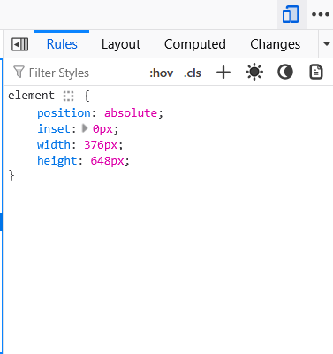

# PROJETO IMOOD - ENGENHARIA DE SOFTWARE

Este é o frontend para o aplicativo de mapeamento emocional **iMood**, desenvolvido como parte do projeto da disciplina de Engenharia de Software.

---

##  Como Executar o Projeto

Existem duas maneiras de visualizar o projeto: uma simplificada (sem precisar do Flutter) e outra completa (para desenvolvedores com o Flutter instalado).

### Método 1: Visualização Rápida (Sem Flutter)

Este método é ideal para uma rápida demonstração do frontend.

1.  **Execute o arquivo `EXECUTAR_PROJETO.bat`** com um duplo clique.
2.  O script irá verificar se o Python está instalado e, em seguida, iniciará um servidor web local.
3.  O projeto será aberto automaticamente no seu navegador padrão no endereço: `http://localhost:8080`
4.  **Atenção!** Para que todas as funcionalidades (login, histórico, etc.) operem corretamente, é essencial que a **API do backend esteja rodando** simultaneamente.

---

### Método 2: Execução Completa (Com Flutter)

Este método é para desenvolvedores que desejam rodar o projeto no ambiente de desenvolvimento do Flutter.

1.  Abra um terminal e navegue até a pasta principal do projeto.
2.  Execute `flutter pub get` para baixar todas as dependências necessárias.
3.  Conecte um dispositivo, inicie um emulador ou prepare o navegador (Chrome).
4.  Execute `flutter run` para compilar e iniciar o aplicativo.

---

##  Recomendações de Visualização

Para uma melhor experiência, especialmente ao rodar no navegador, ative o **modo de design responsivo** (geralmente pressionando `F12` ou `Ctrl+Shift+I` e clicando no ícone de celular/tablet) para simular a visão de um aplicativo mobile.

---

##  Requisitos

*   **API do Backend:** O servidor do backend **precisa estar rodando** para que o frontend funcione corretamente, pois muitas funcionalidades dependem de chamadas à API.
*   **Windows:** Para executar os scripts `.bat`.
*   **Python 3.x:** Necessário para o "Método 1". O script avisará se não o encontrar.
*   **Flutter SDK 3.x:** Necessário para o "Método 2".

---

##  Como Parar a Execução

*   **Método 1 (Servidor .bat):** Basta fechar a janela do terminal (preta) que foi aberta.
*   **Método 2 (Flutter Run):** No terminal onde o Flutter está rodando, pressione a tecla `q` para encerrar
